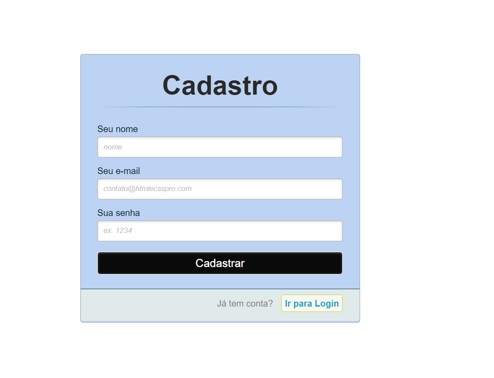
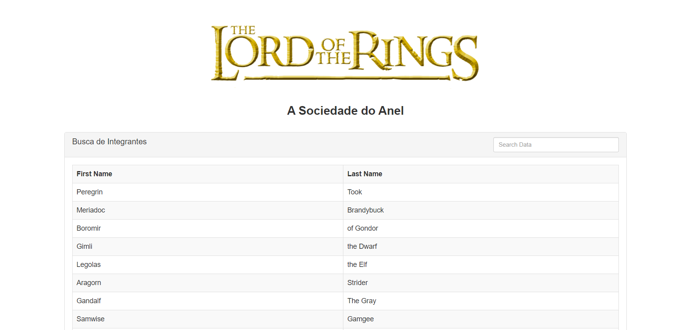

# Exemplo CRUD com BD Relacional

Projeto feito em sala de aula para testar o uso de Banco de Dados Relacional.

## 🚀 DEMO

[Link para Demo](https://jed1rey.000webhostapp.com/index.html)
[Busca de Integrante](https://jed1rey.000webhostapp.com/buscaAlunos.html)
[Sistema de Cadastro](https://jed1rey.000webhostapp.com/cadastroAlunos.html)
[Menu](https://jed1rey.000webhostapp.com/dashboard.html)

## 🛠️ Construído com

* [MySQL](https://www.000webhost.com/) - Banco construido com 000Webhost gratuitamente.
* [PHP](https://www.php.net/) - Linguagem para conexão com banco de dados e execução do CRUD.
* [VueJS](https://vuejs.org/) - Usada para gerenciar as interações entre páginas

## ✒️ Telas

